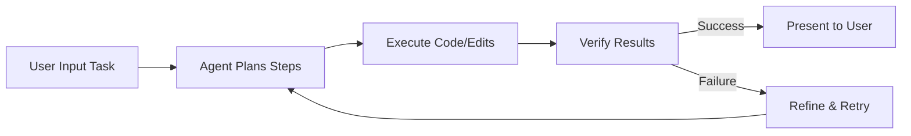

# AI-Powered Agentic IDE Design Document

## Overview

This design document outlines the architecture and implementation for building an AI-powered Integrated Development Environment (IDE) inspired by tools like Google Antigravity and Cursor. The goal is to create an "Agentic IDE" that leverages AI agents to automate coding tasks, provide intelligent autocomplete, and enable natural language-based development. This IDE will be built as a fork of Visual Studio Code (VS Code), extending it with AI capabilities to handle complex tasks autonomously while allowing user oversight.

Key features include:
- **AI Autocomplete and Code Generation**: Predictive suggestions and multi-line edits based on context.
- **Agentic Workflows**: AI agents that plan, execute, verify, and iterate on tasks.
- **Multi-Model Support**: Integration with various LLMs (e.g., Gemini, GPT models).
- **Cross-Surface Integration**: Synchronization across editor, terminal, and browser.
- **Mission Control Interface**: Central dashboard for managing multiple agents.

The IDE targets developers seeking to accelerate workflows, from hobbyists to enterprise users. It emphasizes trust through verifiable agent actions and user feedback loops.

## Requirements

### Functional Requirements
- **Editor Core**: Support syntax highlighting, debugging, and extensions similar to VS Code.
- **AI Integration**:
  - Natural language commands for code edits (e.g., "Refactor this function to use async/await").
  - Autocomplete with context awareness (file, codebase, recent changes).
  - Agent management: Create, configure, and monitor AI agents for tasks like bug fixing or app building.
- **Codebase Understanding**: Index and search the entire project for semantic context.
- **User Interface Enhancements**: Inline suggestions, chat panels, and a mission control view.
- **Security and Privacy**: Local indexing options and API key management for AI models.

### Non-Functional Requirements
- **Performance**: Fast inference (under 500ms for autocomplete), scalable to large codebases.
- **Compatibility**: Cross-platform (Windows, macOS, Linux) via Electron.
- **Extensibility**: Support for custom models and plugins.
- **Usability**: Intuitive shortcuts (e.g., Ctrl+K for edits) and dark/light modes.
- **Reliability**: Error handling for AI failures, with fallback to manual coding.

## High-Level Architecture

The IDE is structured as a modular system built on VS Code's open-source foundation. Core components include the editor, AI engine, agent manager, and UI extensions. AI interactions occur via API calls to external models, with local processing for privacy-sensitive tasks.

### Architecture Diagram

```mermaid
graph TD
    A[User Interface] --> B[Editor Core (VS Code Fork)]
    A --> C[Mission Control Dashboard]
    B --> D[Codebase Indexer]
    B --> E[AI Engine]
    C --> E
    E --> F[Agent Manager]
    F --> G[LLM APIs (Gemini, GPT, etc.)]
    F --> H[Task Planner]
    F --> I[Executor & Verifier]
    D --> E
    subgraph "Cross-Surface Integration"
        B --> J[Terminal Agent]
        B --> K[Browser Agent]
    end
```

This diagram shows the flow from user inputs through the editor and mission control to the AI engine, which orchestrates agents via external LLMs. The codebase indexer provides context, while cross-surface agents enable workflows beyond the editor.

## Detailed Components

### 1. Editor Core
- **Base**: Fork Microsoft/vscode repository (MIT license).
- **Extensions**: Add custom VS Code extensions for AI features using TypeScript.
- **Features**: Syntax highlighting, debugging, Git integration (inherited from VS Code).
- **Implementation**: Use Electron for desktop app packaging. Customize the workbench with additional panels for AI chats.

### 2. Codebase Indexer
- **Purpose**: Builds a semantic index of the project for context-aware AI.
- **Tech**: Use libraries like Tantivy or SQLite for local search; integrate with VS Code's workspace API.
- **Workflow**: On project open, scan files, parse ASTs (Abstract Syntax Trees) using Tree-sitter, and store embeddings via a vector database (e.g., FAISS).
- **Scalability**: Handle large repos by chunking and updating incrementally.

### 3. AI Engine
- **Core Functionality**: Handles autocomplete, code generation, and queries.
- **Integration**: API wrappers for models like Google Gemini, OpenAI GPT, or Anthropic Claude.
- **Prompt Engineering**: System prompts for tasks, e.g., "Generate code based on this context: [code snippet]".
- **Optimization**: Caching for repeated queries; fine-tuning support for custom models.

### 4. Agent Manager
- **Purpose**: Manages autonomous AI agents for complex tasks.
- **Components**:
  - **Task Planner**: Breaks down user requests into steps (e.g., "Build a web app" → Plan UI, backend, deploy).
  - **Executor**: Runs code generation, file edits, and terminal commands.
  - **Verifier**: Checks outputs (e.g., run tests, validate syntax) and iterates if needed.
- **Multi-Agent Support**: Parallel agents for subtasks, synchronized via a central queue.
- **Feedback Loop**: Users can intervene via UI to refine agent behavior.

### Agent Workflow Diagram



This flowchart illustrates the iterative process of an agent handling a task, ensuring reliability through verification.

### 5. User Interface Extensions
- **Mission Control**: A dashboard view (React-based) showing agent status, artifacts, and logs.
- **Shortcuts**: Ctrl+K for inline edits, Ctrl+L for chat, F3 for mission control.
- **Inline Features**: Diff views for AI suggestions, accept/reject buttons.
- **Cross-Surface**: Embed agents in terminal (e.g., auto-run commands) and browser (e.g., web research for code).

### 6. Integration with External Services
- **LLMs**: Configurable API keys; fallback to local models if available (e.g., via Hugging Face).
- **Tools**: GitHub for PR reviews, Slack for notifications.
- **Security**: Encrypt API traffic; optional on-device inference.

## Implementation Plan

### Phase 1: Setup Base IDE (2-4 weeks)
- Fork VS Code repo.
- Set up build pipeline with Electron.
- Add basic extensions skeleton.

### Phase 2: Add Core AI Features (4-6 weeks)
- Implement autocomplete using LLM APIs.
- Build codebase indexer.
- Add natural language command handler.

### Phase 3: Develop Agentic Capabilities (6-8 weeks)
- Create agent manager with planner, executor, verifier.
- Integrate multi-agent support.
- Add verification loops (e.g., auto-test running).

### Phase 4: UI Enhancements and Cross-Surface (4 weeks)
- Build mission control dashboard.
- Extend to terminal and browser agents.

### Phase 5: Testing and Polish (4 weeks)
- Unit tests for components.
- End-to-end tests for workflows.
- Beta release for feedback.

### Tech Stack
- **Frontend**: TypeScript, React (for custom UI).
- **Backend**: Node.js for extensions.
- **AI**: Axios for API calls; optional TensorFlow.js for local models.
- **Databases**: SQLite/FAISS for indexing.
- **Build Tools**: Webpack, Electron Forge.

## Potential Challenges and Mitigations
- **AI Hallucinations**: Use verification steps and user feedback.
- **Performance**: Optimize context size; use faster models like Gemini Flash.
- **Cost**: Monitor API usage; offer free tiers with limits.
- **Privacy**: Allow local-only modes.

## Appendices

### Table 1: Comparison with Inspirations

| Feature                  | Proposed IDE                  | Google Antigravity                                                                 | Cursor AI                                                                 |
|--------------------------|-------------------------------|------------------------------------------------------------------------------------|---------------------------------------------------------------------------|
| Base                     | VS Code Fork                 | VS Code Fork                                                                       | VS Code Fork                                                              |
| AI Models                | Gemini, GPT, Claude          | Gemini 3 (Pro, Deep Think, Flash)                                                  | GPT-5.2, Anthropic, Gemini, xAI                                          |
| Agentic Support          | Multi-agent with planner     | Cross-surface agents, mission control                                              | Multi-agent collaboration, reinforcement learning                         |
| Autocomplete             | Context-aware Tab            | Tab autocompletion                                                                 | Specialized Tab model                                                     |
| Codebase Understanding   | Semantic indexing            | Context-aware agents                                                               | Complete codebase indexing                                                |
| UI Enhancements          | Mission Control, shortcuts   | Central mission control, synchronized surfaces                                     | Mission Control grid, inline edits                                        |

This table highlights similarities and customizations in the proposed design.

### Table 2: Key Shortcuts

| Shortcut | Description                  |
|----------|------------------------------|
| Ctrl+K   | Inline code edit             |
| Ctrl+L   | Open AI chat panel           |
| Ctrl+I   | Multi-file edits             |
| F3       | Open Mission Control         |

---

## Detailed Survey of AI-Powered Agentic IDE Design

Building an AI-powered IDE like Google Antigravity or Cursor represents a shift toward "agent-first" development, where AI doesn't just assist but autonomously handles tasks. This survey expands on the design, drawing from real-world implementations to provide a comprehensive blueprint. It includes deeper technical details, rationale, and extensions for advanced features.

### Conceptual Foundation
Traditional IDEs like VS Code focus on tools for human coders. Agentic IDEs evolve this by integrating AI agents—autonomous entities that plan, code, verify, and iterate with minimal intervention. Inspired by Google Antigravity's emphasis on trust-building through artifacts and Cursor's multi-agent collaboration, the design prioritizes verifiability and scalability.

Research suggests that such systems can accelerate development by 2-5x for repetitive tasks, though they require careful handling of AI limitations like context windows (typically 128k-1M tokens). Evidence from tools like Cursor shows 70% code generation in workflows, but success depends on prompt optimization and context injection.

### In-Depth Requirements Analysis
Functional requirements extend beyond basics:
- Support for languages like Python, JavaScript, Java via LS (Language Servers).
- Agent tasks: From simple (refactor code) to complex (build full apps with deployment).
- Integration with version control: Auto-commit verified changes.

Non-functional aspects include:
- Latency: Aim for <300ms autocomplete using optimized models.
- Accessibility: WCAG compliance in UI.
- Extensibility: Plugin marketplace for custom agents.

### Architectural Deep Dive
The architecture is layered:
1. **Presentation Layer**: Electron-based UI with React components for dynamic views.
2. **Application Layer**: VS Code extensions handling logic.
3. **AI Layer**: Orchestrates LLM calls, context assembly (code + user input + index).
4. **Data Layer**: Local storage for indexes, caches.

Data flow: User inputs → Parsed by editor → Enriched with index → Sent to agent → LLM inference → Verification → UI update.

For large codebases, use chunking: Divide files into embeddings, retrieve top-k relevant via cosine similarity.

### Component Breakdown with Implementation Notes
#### Editor Core
Fork from github.com/microsoft/vscode. Customize via `src/vs/workbench` for AI panels. Use VS Code's API for events (e.g., onDidChangeTextDocument) to trigger AI suggestions.

#### Codebase Indexer
Implement as an extension:
- Parse code with Tree-sitter for ASTs.
- Generate embeddings using a lightweight model (e.g., Sentence Transformers).
- Store in FAISS for vector search.
- Update on file changes via watchers.

This enables queries like "Find similar functions" for better context.

#### AI Engine
Wrapper class in TypeScript:
```typescript
class AIEngine {
  async generate(prompt: string, context: string): Promise<string> {
    // Assemble full prompt with system instructions
    const fullPrompt = `System: You are a coding agent. Context: ${context}\nUser: ${prompt}`;
    // Call API, e.g., to Gemini
    const response = await fetch('https://api.google.com/gemini', {
      method: 'POST',
      body: JSON.stringify({ prompt: fullPrompt }),
      headers: { 'Authorization': `Bearer ${apiKey}` }
    });
    return response.text();
  }
}
```
Support model switching via config.

#### Agent Manager
Central to agentic design:
- **Planner**: Use LLM to decompose tasks (e.g., chain-of-thought prompting: "Step 1: Analyze requirements...").
- **Executor**: Apply diffs using VS Code's TextEdit API.
- **Verifier**: Run linters, tests (integrate Jest/Pytest), or custom scripts.
- Multi-agent: Use a queue system (e.g., BullMQ) for parallelism.

Handle failures with retries or user prompts.

#### User Interface Extensions
- Mission Control: A React component rendering agent cards with status (planning, executing).
- Cross-Surface: For terminal, inject agents via child processes; for browser, use WebView in VS Code.

### Advanced Features
- **Reinforcement Learning**: Fine-tune agents based on user accepts/rejects (inspired by Cursor).
- **Shadow Workspaces**: Test agent changes in isolated environments before applying.
- **Enterprise Scaling**: Support for team collaboration, e.g., shared agents via cloud sync.

### Development and Testing Strategy
Use Agile: Iterate on prototypes. Test with scenarios like "Build a TODO app" to measure accuracy.
- Unit: Mock LLM responses.
- Integration: End-to-end with Selenium for UI.
- Performance: Benchmark inference times.

Deployment: Package as .exe/.dmg/.deb; host on GitHub for open-source.

### Risk Assessment
- Dependency on external APIs: Mitigate with fallbacks.
- Ethical Concerns: Ensure agents don't generate malicious code via safety prompts.
- Cost: Free tier with rate limits; premium for advanced models.

This design provides a robust foundation, adaptable to evolving AI tech.

## Key Citations
- [Google Antigravity Official Site](https://antigravity.google/) 
- [Reddit Discussion on Antigravity](https://www.reddit.com/r/google/comments/1p10ev8/has_anyone_tried_antigravity_by_google_thoughts) 
- [Google Antigravity Codelab](https://codelabs.developers.google.com/getting-started-google-antigravity) 
- [Wikipedia on Google Antigravity](https://en.wikipedia.org/wiki/Google_Antigravity) 
- [Cursor AI Official Site](https://www.cursor.com/) 
- [Blog on How Cursor Works](https://blog.sshh.io/p/how-cursor-ai-ide-works) 
- [DataCamp Tutorial on Cursor](https://www.datacamp.com/tutorial/cursor-ai-code-editor)
